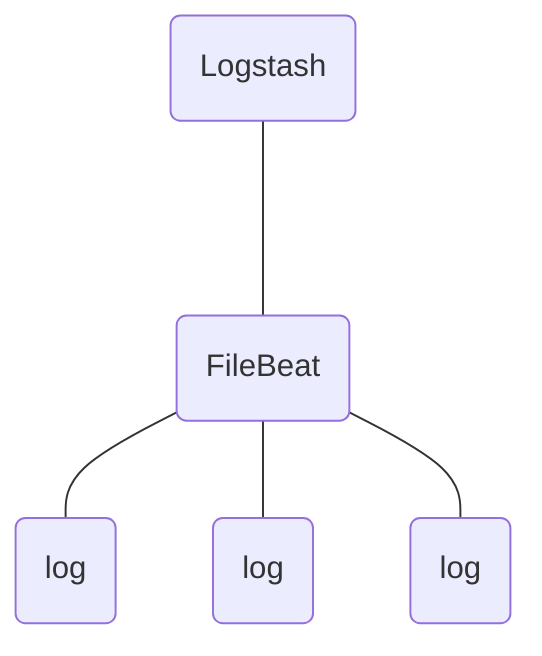

FileBeat é um sistema "leve" para entrega de logs.

- gestão de fluxo de logs.
-  evita sobrecarga no [[logstash]]

### Backpressure:


Filebeat tem um ponteiro de leitura que aponta para os logs, caso o logstash não suporte a taxa de leitura o logstash notifica o filebeat via **backpressure protocol** o fazendo diminuir a taxa de leitura.


### Instalação:
via container usando a imagem `docker.elastic.co/beats/filebeat:8.12.0`

### configuração: 
>[!INFO] 
>
>é possível conectar o Filebeat diretamente ao elasticSearch mas também pode-se conectar ao Logstash e por ele ajustar o conteúdo dos logs e envia-los para o elastisearch


#### Conectando diretamente ao elasticSearch:


```yaml
	filebeat: 
		image: docker.elastic.co/beats/filebeat:8.12.0
		container_name: filebeat 
		user: root
	   volumes:
		- ./filebeat.docker.yml:/usr/share/filebeat/filebeat.yml:ro
		- /var/lib/docker/containers:/var/lib/docker/containers:ro 
	   environment: 
		- ELASTICSEARCH_HOSTS=http://elasticsearch:9200 
	   depends_on: 
		  - elasticsearch

```

#### Conectando ao logstash:

``` yaml

filebeat:
    image: docker.elastic.co/beats/filebeat:8.12.0
    container_name: filebeat
    user: root
    volumes:
      - ./filebeat.docker.yml:/usr/share/filebeat/filebeat.yml:ro
      - /var/log:/var/log:ro
    depends_on:
      - logstash


```

O input do do [[logstash]] deve ser alterado para a URL do filebeat:
```conf
input {
	beats:{
	
	port:5044
	}
}

```
### Arquivo de configuração 
O Arquivo `filebeat.yml` que define a configuração do Filebeat.

``` yaml
filebeat.inputs: 
	- type: filestream 
	  id: logs-sistema 
	  enabled: true 
	paths: 
		- /var/log/*.log
		  
```

