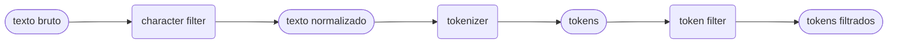

### Mapping: 
Mapping é basicamente o processo de esquematização de[[ índice]], nele que definimos como os [[Documentos]] serão estruturados e seus tipos.
  
POST http://localhost:9200/products
```json

{

"mappings": {

"properties": {

"name": { "type": "text", "analyzer": "portuguese" },

"price": { "type": "float" },

"description": {

"type": "text",

"analyzer": "portuguese"

}}}

}

  


```

### tipos no schema:
definidos pelo atributo type

- **`text`**: Usado para conteúdo de corpo de texto (como descrições ou posts). Ele é processado por um **analyzer** antes de ser indexado. Isso permite buscas por termos parciais ou palavras-chave dentro de uma frase. 

- **`keyword`**: Usado para dados exatos e estruturados (como IDs, emails ou categorias). Ele **não** passa por análise; o valor é indexado exatamente como foi enviado. É ideal para filtros, ordenação e agregações.

- **long,  integer, double**: Usado para valores inteiros.

### analyzers:
define como campo text deverá ser processado tanto no indexing tanto quanto na busca.
##### Etapas do analyzer


> [!info]
>  Analyzers só funcionam em propriedades do tipo text
### Indexing
Indexing é a inserção de documento onde texto é tokenizado e o índice é invertido.

POST http://localhost:9200/products/_doc

```json

{"name": "Boné Águia de Fogo", "price": 300, "description": "Melhor produto de boné"}

```


