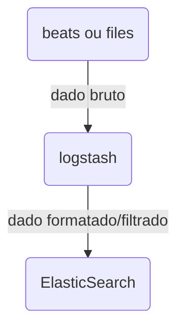

Parte da ElasticStack, importante para importação de dados, Extração, Transformação e Carga(ETL).

- pode analisar e filtrar dados.
- pode produzir dados estruturados.
- pode escalar entre vários nos.
- variedade de fontes de entrada(s3, salesforce, jdbc, kafka, etc...)
- variedade de destinos.




### Instalação
Pode ser instalado na própria máquina:

```shell
sudo apt-get install logstash
```

ou via Docker com a imagem `docker.elastic.co/logstash/logstash:8.12.0`
### Configuração
A configuração do logstash depende do arquivo `logstash.conf` que lista plugins de input, output e filter.

```conf
input {

file {

path => "/logs/logstash/access_log"

start_position => "beginning"

sincedb_path => "/dev/null"

}

}

  

filter {

grok {

match => { "message" => "%{COMBINEDAPACHELOG}" }

}

date {

match => ["timestamp", "dd/MMM/yyyy:HH:mm:ss Z"]

}

}

  

output {

elasticsearch {

hosts => ["http://elasticsearch:9200"]

}

stdout {

codec => rubydebug

}

}

```

### Input
file->path: caminho do arquivo de logs
file->start_position: por onde começa a leitura do arquivo de log


### Filter
grok: Como os dados devem ser extraídos, existem padrões pré configurados.
date: forma como a data será extraída.

### Output
elasticsearch: host do elastic que receberá o dado.
stdout: console visualizador. 
