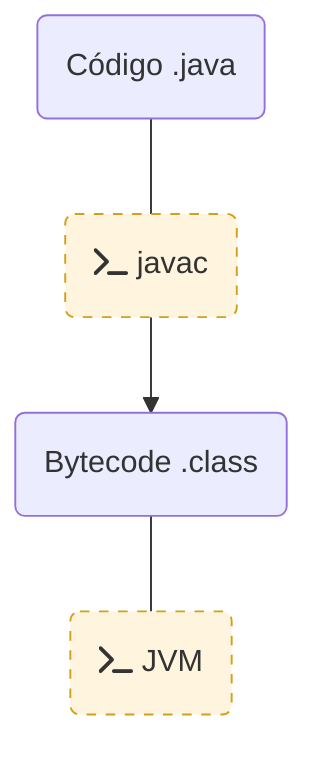

Compilador java que converte código (.java) para byte code(.class) que será executado pela JVM.

```mermaid
graph TD
   A(Código .java) --- Tool1(fa:fa-terminal javac)
   Tool1 --> B(Bytecode .class)
   B --- Tool2(fa:fa-terminal JVM)

   %% Estilização para parecer um balão/nota
   style Tool1 fill:#fff4dd,stroke:#d4a017,stroke-dasharray: 5 5
   style Tool2 fill:#fff4dd,stroke:#d4a017,stroke-dasharray: 5 5
```
